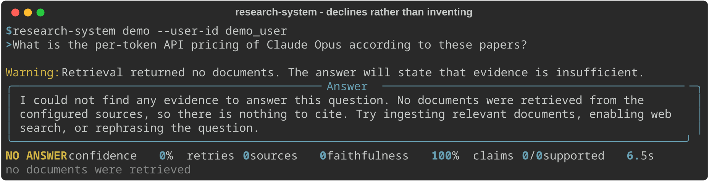
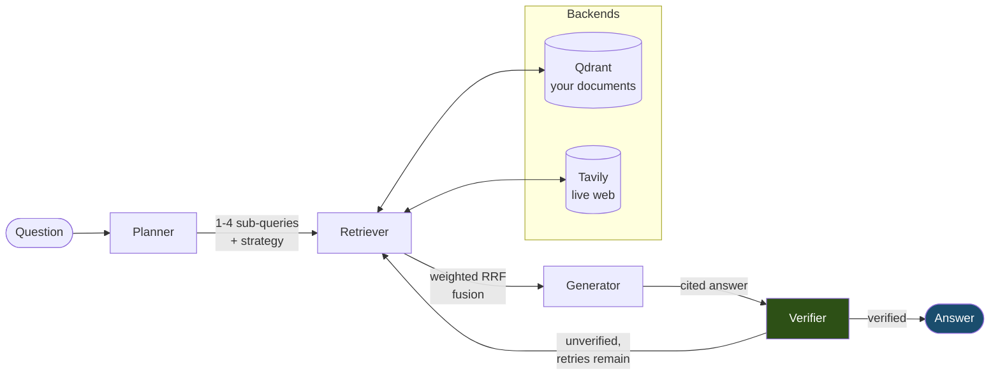
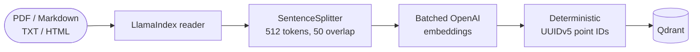
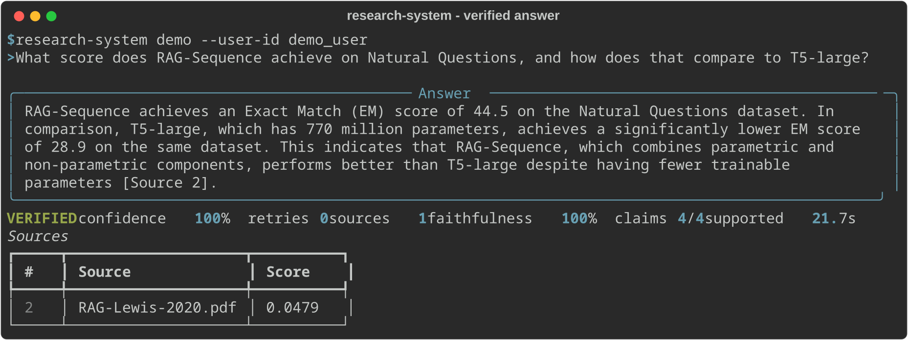
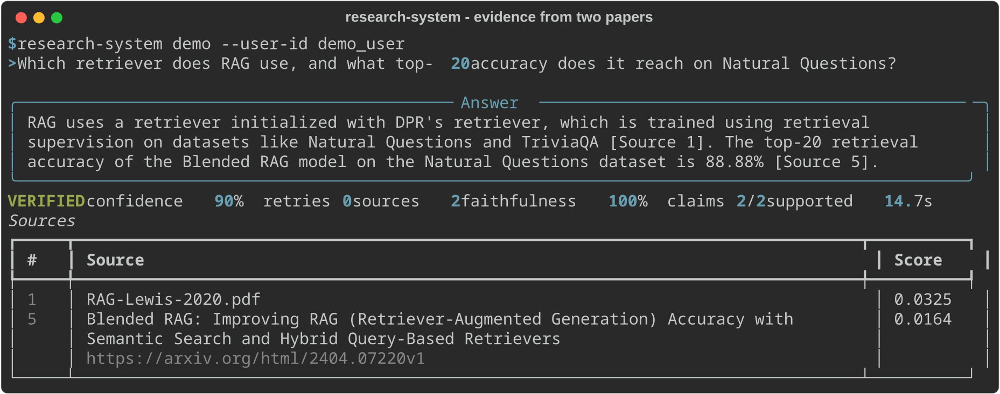
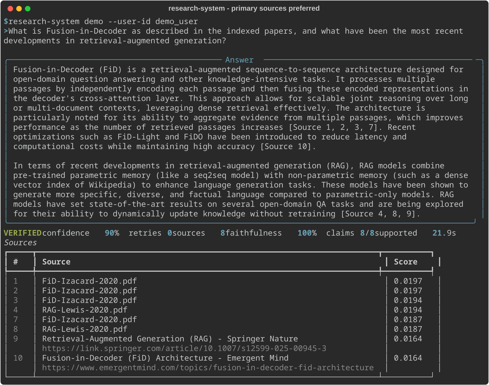
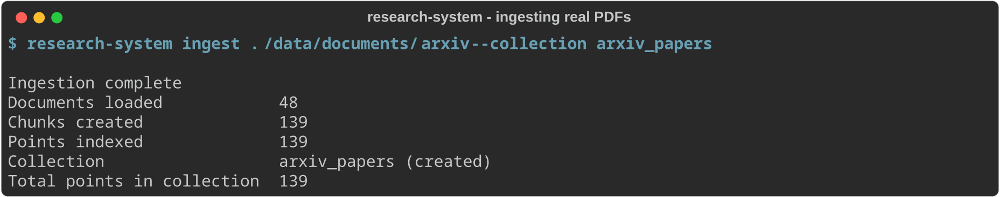
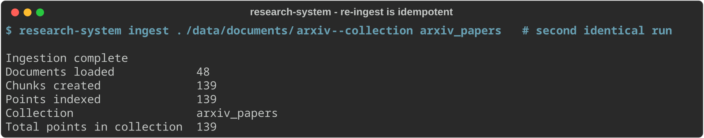

# SourceWeave

**A research assistant that fact-checks its own answers and refuses to guess.**

[]()
[]()
[]()

---

## The problem

Retrieval-augmented systems are confident by default. Ask one something its
documents do not cover and it will usually produce a fluent, well-formatted,
completely invented answer. The failure is invisible: nothing in the output
distinguishes a fact that came from your documents from one the model made up.

SourceWeave attacks this directly. Every answer is broken back into its
individual factual claims, each claim is checked against the sources that were
actually retrieved, and the resulting score is **recomputed in code** rather
than taken from the model's word for it. When the score falls short, the system
writes sharper search queries aimed at the specific claims that failed and tries
again. When the evidence genuinely is not there, it says so.

```
NO ANSWER  confidence 0%  retries 0  sources 0
no documents were retrieved
```

That line is the point of the project.

<p align="center">
  
</p>

Asked about API pricing that appears nowhere in the indexed papers, the system
declines. No invented figure, no citations manufactured to look authoritative.

---

## What it does

- **Answers from your documents and the live web**, fusing both into one ranked
  evidence set
- **Cites every factual claim**, with citation indices validated against the
  evidence actually shown to the model — a model-reported source list is never
  trusted
- **Fact-checks itself**, extracting claims and scoring how many are supported
- **Retries intelligently**, rewriting queries from the claims that failed
  rather than repeating the same search
- **Distinguishes three outcomes** — verified, unverified, and no answer —
  because a truthful "I don't know" is not the same thing as an answer
- **Runs its whole test suite offline**, with no API keys and no network

> **Note on naming.** The repository is `SourceWeave`; the installed command is
> `research-system`. The package name predates the project name and was left
> alone rather than churn every import for cosmetics.

---

## Architecture



Four stages, each with one job:

| Stage | Responsibility |
|---|---|
| **Planner** | Break the question into 1–4 independent sub-queries; choose `vector`, `web`, or `hybrid` |
| **Retriever** | Search each backend per sub-query; fuse the ranked lists with Reciprocal Rank Fusion |
| **Generator** | Write a source-cited answer using only the retrieved evidence; report whether it actually answered |
| **Verifier** | Extract claims, check each against the same numbered evidence, score faithfulness, refine queries on failure |

**The retry edge goes back to Retrieval, not Planning.** When verification
fails, the decomposition was usually fine — the *evidence* fell short. Replanning
would rewrite a question that was never the problem.

### Ingestion



Point IDs are a UUIDv5 over source filename, chunk position, and normalised
chunk text. Re-ingesting an unchanged corpus overwrites the same IDs, so the
collection does not grow.

---

## Quick start

```bash
git clone https://github.com/Salman-Awaise/SourceWeave.git
cd SourceWeave
uv sync --all-extras

cp .env.example .env          # add OPENAI_API_KEY; the rest are optional
docker compose up -d qdrant   # or point QDRANT_URL at Qdrant Cloud

uv run research-system config                                    # check backends
uv run research-system ingest ./your-documents --collection docs # index them
uv run research-system demo --user-id you                        # ask questions
```

One OpenAI key covers both the reasoning and the embeddings. Add
`TAVILY_API_KEY` for live web search and `MEM0_API_KEY` for memory across
sessions — both optional, and their absence degrades with a warning rather than
an error.

---

## See it work

All screenshots are real terminal output from the CLI, against four arXiv papers
(RAG, DPR, BART, Fusion-in-Decoder) indexed into Qdrant Cloud.

**A verified answer.** Every claim checked against the paper it came from.



`44.5` is the correct Exact Match score from the RAG paper. Four claims
extracted, four supported, one source cited.

**Evidence joined across two papers.**



The architecture comes from one paper and the accuracy figures from another,
fused into a single answer with both cited.

**Primary sources preferred over web summaries.**



Six citations to the indexed papers, with two web sources retained for the part
of the question that needed current information.

**Ingestion, and re-ingestion.**




The same command run twice. 139 points, then still 139 — not 278.

---

## How it works

The parts worth explaining are the ones where the obvious approach is wrong.

### Faithfulness is recomputed, never reported

The verifier returns claim lists and a score. **The score is discarded and
recalculated** as `supported / total`. A model that lists three of ten claims as
unsupported while reporting `0.95` does not get to set the number, and a warning
records the discrepancy.

### Structured output has three tiers, and knows when not to retry

Model output is requested as the provider's native JSON schema, falling back to
JSON-object mode, falling back to locating the first balanced JSON object in the
text. All three end at the same Pydantic validation — the third tier is a
*locator*, not a parser, which is why it is safe in a way that splitting on
Markdown code fences is not.

Crucially, a **schema violation aborts the chain immediately**. If the model
returns clean JSON with an invalid value, a different output format cannot fix a
value, and re-sending the same prompt reproduces the same answer.

### Retrieval degrades, broadens, and stays hybrid

- A missing backend on `hybrid` produces a warning, not a failure
- An *explicit* `vector` or `web` strategy whose backend is unavailable raises a
  typed error, because silently answering from somewhere else is worse
- A strategy that returns **zero** evidence broadens to an unused backend rather
  than reporting "insufficient evidence" while a working search sits idle
- Fusion weights indexed documents above web summaries, and a per-source-type
  floor stops that weighting from eliminating a backend entirely

### Everything external sits behind a protocol

The LLM, embeddings, vector store, web search, and memory are each an interface
with a real implementation and a fake one. That is what lets **270 tests run in
about three seconds with no credentials and no network** — and it is why
switching the model provider is a one-line change to `.env` rather than a code
change.

### Untrusted input is treated as untrusted

Document text, web snippets, memories, and chat history are wrapped in tagged
blocks, closing tags are neutralised so content cannot break out, and every
prompt carries a standing instruction not to follow instructions found inside
those blocks.

---

## Project structure

```
src/research_system/
├── cli.py               # four commands: ingest, demo, evaluate, benchmark
├── config.py            # settings, credential gates, secret redaction
├── errors.py            # typed errors; the CLI prints these without a traceback
├── schemas.py           # validated shapes for every structured model output
├── prompts.py           # evidence formatting shared by generator and verifier,
│                        #   so both see identically numbered sources
├── ingestion.py         # documents -> chunks -> embeddings -> Qdrant
├── tracing.py           # optional LangSmith; content redacted by default
├── core/
│   ├── state.py         # domain records and the graph state
│   ├── deps.py          # adapter injection — how tests run without network
│   ├── graph.py         # LangGraph assembly and the retry edge
│   └── pipeline.py      # run_query: memory, bounds, public result contract
├── agents/
│   ├── planner.py       # decomposition and strategy selection
│   ├── retriever.py     # backends, RRF fusion, degradation, broadening
│   ├── generator.py     # cited answers, citation validation, declining
│   └── verifier.py      # claim extraction, scoring, query refinement
└── adapters/
    ├── llm.py           # LiteLLM behind a protocol, three-tier structured output
    ├── embeddings.py    # batched OpenAI embeddings
    ├── qdrant_store.py  # deterministic IDs, payload indexing, filters
    ├── web_search.py    # Tavily
    └── memory.py        # mem0, tolerant of its 1.x/2.x signature drift

tests/
├── unit/                # 11 files, fully offline
└── integration/         # graph paths offline; Qdrant tests opt-in
```

---

## Results

Measured against real services.

### Multi-agent vs single-agent baseline

Ten questions answerable from the indexed corpus, scored with Ragas. The
baseline is held identical in every respect except the two things being
compared: it skips query decomposition and has no verification loop.

| Metric | Multi-agent | Single-agent | Delta |
|---|---:|---:|---:|
| faithfulness | **0.9833** | 0.8994 | **+0.0839** |
| answer relevancy | **0.9425** | 0.9422 | +0.0003 |
| context precision | **0.8126** | 0.7760 | **+0.0366** |
| context recall | 1.0000 | 1.0000 | 0.0000 |

Verification pass rate 1.00, retry rate 0.00, 13.2 s average per question.

### Real document ingestion

Four arXiv papers, unmodified:

```
Documents loaded            48        (PDFs load one page at a time)
Chunks created              139
Points indexed              139
```

Page numbers preserved on 139/139 chunks. A second identical run: 139 points,
not 278.

---

## What broke, and what we did about it

Found by running against real documents, not fixtures.

| Symptom | Cause | Fix | Outcome |
|---|---|---|---|
| Answers cited web blog posts while the indexed paper sat unused at rank 1 | RRF is nearly flat; with each result in one list every score collapsed to ≈1/61 | Per-source-type fusion weights, plus a floor so weighting cannot erase a backend | 0 → **6** paper citations, 2 web retained |
| A wrong enum value cost three API calls and printed a traceback | The retry tiers exist for *format* failures; a different format cannot change a value | Separated schema violations from parse failures | 3 calls → **1** |
| Declining looked broken when memory held the answer | Memory reaches the planner only, by design | Explain it in the message rather than change the guarantee | decline now states why |
| "VERIFIED, confidence 0%" on a non-answer | A truthful "I don't know" scores 1.0 faithfulness — correctly | Third state: `NO ANSWER`, citing nothing | label matches reality |
| Metadata filtering worked locally, failed on Qdrant Cloud | Cloud refuses to filter on an unindexed payload field | Create the index on demand and retry once | works on both |

### Fixes rejected after measurement

Four plausible fixes were tested and **not built**, which is the more useful
record:

- **A relevance-checking LLM pass** — the failing answer *was* relevant to the
  sub-query asked. The gate would have passed it, at the cost of an extra call
  on every query.
- **A score threshold to filter junk web results** — the irrelevant result
  scored **0.80**, higher than several legitimate sources. The threshold would
  have removed good results first.
- **Also retrieving on the original question** — measured **zero** additional
  relevant hits.
- **Folding relevance into the verifier** — would risk degrading the claim
  extraction that already works.

---

## Design documents

The full design record lives in [`docs/design/`](docs/design/):

| Document | Answers |
|---|---|
| [Charter](docs/design/charter.md) | Why the project exists, scope, success criteria |
| [Requirements](docs/design/requirements.md) | What Release 0.1 must do, prioritised with MoSCoW |
| [Architecture Overview](docs/design/architecture-overview.md) | Layers, agents, state, retrieval, failure and security boundaries |
| [Decision Register](docs/design/decision-register.md) | 22 architecture decisions with context and consequences |
| [Architecture Spikes](docs/design/spikes.md) | Five experiments used to test risky assumptions, with recorded outcomes |

Architecture Overview section 23 compares what was designed against what was
built, and section 23.1 lists what remains outstanding.

---

## Configuration

`.env`, all optional except the provider key for your chosen model.

| Variable | Default | Purpose |
|---|---|---|
| `OPENAI_API_KEY` | — | reasoning **and** embeddings |
| `DEFAULT_LLM` | `gpt-4o` | any LiteLLM-supported model; the name selects the provider |
| `EMBEDDING_MODEL` / `EMBEDDING_DIM` | `text-embedding-3-small` / 1536 | |
| `QDRANT_URL` / `QDRANT_API_KEY` | `http://localhost:6333` | leave the key blank for local |
| `TAVILY_API_KEY` | — | web search; absence degrades with a warning |
| `MEM0_API_KEY` | — | memory; absence degrades with a warning |
| `LANGCHAIN_API_KEY` | — | LangSmith tracing; off without it |
| `TRACE_CONTENT` | `false` | opt in to sending document text to tracing |
| `FAITHFULNESS_THRESHOLD` | `0.7` | verification pass mark |
| `MAX_VERIFICATION_RETRIES` | `2` | retrieval retries after a failed check |
| `MAX_RETRIEVAL_DOCS` | `10` | evidence cap |
| `SIMILARITY_TOP_K` | `5` | vector hits per sub-query |
| `WEB_RESULTS_PER_QUERY` | `3` | web hits per sub-query |
| `DOCUMENT_WEIGHT` / `WEB_WEIGHT` | `1.2` / `1.0` | fusion preference by source type |
| `MIN_PER_SOURCE_TYPE` | `2` | reserved slots so weighting cannot erase a backend |
| `RRF_K` | `60` | fusion constant |
| `CHUNK_SIZE` / `CHUNK_OVERLAP` | `512` / `50` | |

`research-system config` prints all of it with every secret shown as
`<set>`/`<unset>`.

---

## CLI reference

```bash
research-system ingest SOURCE [--collection NAME] [--chunk-size N] [--chunk-overlap N]
research-system demo [--user-id ID] [--no-memory]
research-system evaluate DATASET [--baseline] [--baseline-strategy S] [-o PATH]
research-system benchmark DATASET [--strategy S] [-o PATH]
research-system config
```

Evaluation datasets are JSON arrays of `{"question": ..., "ground_truth": ...}`.
Results are written as JSON recording model names, dependency versions, and a
SHA-256 of the dataset, so a score can be traced to what produced it.

---

## Testing

```bash
uv run pytest                     # 270 tests, no credentials, ~3 seconds
RUN_INTEGRATION=1 uv run pytest   # +11 against a real Qdrant
uv run ruff check . && uv run mypy
```

Every external service has a fake implementation, so the offline suite covers
the full graph including retry loops, backend degradation, prompt injection
handling, and citation validation — without a single network call.

Integration tests are opt-in and skip loudly when Qdrant is unreachable. That
skip once hid a real bug: the suite silently fell back to `localhost` and
reported clean while testing nothing. A skipped test is not a passing test.

---

## Licence

MIT — see [LICENSE](LICENSE).
